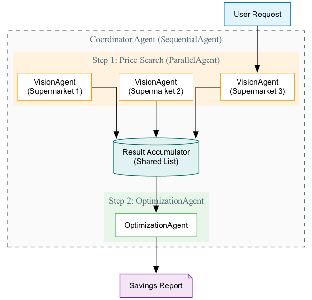
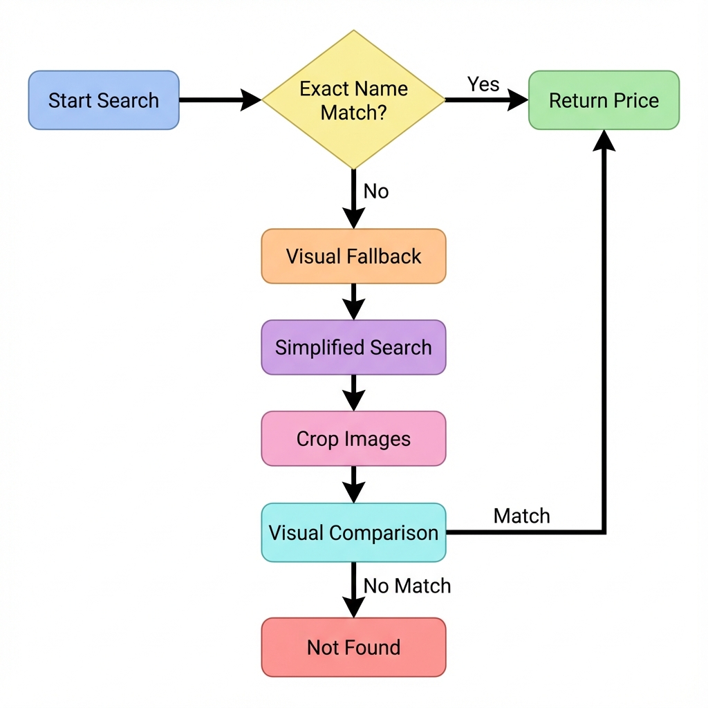
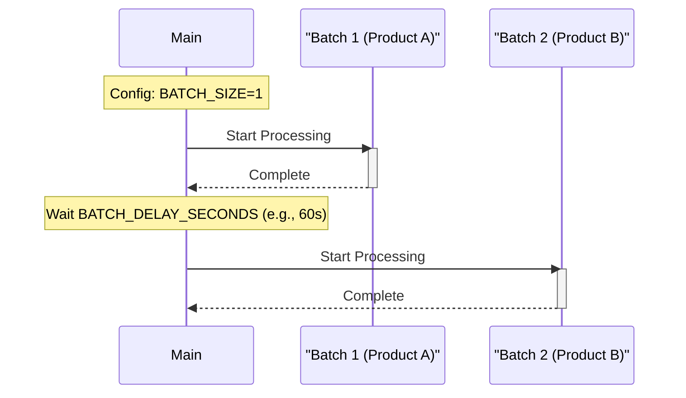

# Grocery Price Optimization Agent - System Architecture

This document provides a comprehensive overview of the agentic system designed to find the best grocery prices across multiple supermarkets.

## 1. 🏗️ High-Level Architecture 

The system is built using the **ADK (Agent Development Kit)**. It uses a hierarchical agent structure to process products efficiently.


### 📊 Agent Hierarchy Diagram 



*Figure 1: The hierarchical structure showing the Coordinator as a Sequential Agent with two steps: (1) Parallel Search, then (2) Optimization.*

### Key Components
1.  **Coordinator (`SequentialAgent`)**: Orchestrates the flow for a single product. It ensures searching happens *before* optimization.
2.  **ParallelSearch (`ParallelAgent`)**: Runs multiple `VisionAgents` simultaneously to fetch prices from different supermarkets at the same time.
3.  **VisionAgent**: A specialized worker that navigates a specific supermarket website to find a specific product.
4.  **OptimizationAgent**: Analyzes the collected prices to calculate savings and recommend switches.

---

## 2. 🔍 Product Discovery Workflow 

The system follows a rigorous process to ensure it finds the *correct* product, not just a keyword match.

### The "Truth" Source
Before searching, the system needs a ground truth.
1.  **Input**: `products.csv` defines the user's current basket.
2.  **Reference Image**: The system captures a "Reference Image" of the product from the user's current supermarket. This serves as the visual template for matching.

### Search Logic: The Two-Stage Process

The `VisionAgent` uses a robust two-stage fallback mechanism to find products.



*Figure 2: The two-stage search process with visual fallback.*

#### Stage 1: Text-Based Verification
- **Query**: Uses the exact full product name (e.g., "Coca Cola Regular 24 X 330 Ml Pack").
- **Verification**: An LLM analyzes the text results to ensure the Brand, Product Type, and Quantity match exactly.

#### Stage 2: Visual Fallback (The "Smart" Search)
If the exact name doesn't work (e.g., different naming conventions), the system:
1.  **Simplifies the Query**: Removes specific details to get broader results (e.g., "Coca Cola").
2.  **Visual Matching**:
    - Uses Gemini Vision to **crop** individual products from the search results screenshot.
    - **Compares** these crops against the **Reference Image**.
    - If the packaging looks the same, it's a match!

---

## 3. ⏳ Quota Management & Rate Limiting 

To handle API quota limits (e.g., Gemini Free Tier), the system implements configurable rate limiting.

### ⏱️ Batch Processing
Instead of launching agents for **ALL** products at once, `main.py` processes them in batches.

**Configuration** (`config.py`):
- **`ENABLE_BATCH_PROCESSING`**: Master flag to enable/disable batch processing
- **`BATCH_SIZE`**: Number of products to process per batch (e.g., `1` = process 1 product across all supermarkets before moving to next product)
- **`BATCH_DELAY_SECONDS`**: Delay in seconds between batches (e.g., `60` = wait 60 seconds before starting next batch)

**Example**: With `BATCH_SIZE=1` and 6 supermarkets, each batch processes 1 product × 6 supermarkets = 6 parallel agents.



### Vision API Rate Limiting
Inside each `VisionAgent`, there is a semaphore to limit concurrent API calls across the entire application.

- **`VISION_MAX_CONCURRENT_CALLS`**: Controls how many agents can talk to Gemini Vision at the exact same instant.
- **`VISION_CALL_DELAY_SECONDS`**: Adds a "breathing room" delay between calls.

---

## 4. 📈 Optimization & History 

### Optimization Logic
The `OptimizationAgent` compares the found prices against the user's current price.
- **Price Preference**: Configurable via `USE_MEMBERSHIP_PRICE_FOR_CURRENT`.
    - If `True`: Compares against your current *Membership* price (if you have one).
    - If `False`: Compares against your current *Regular* price.
- **Savings Calculation**: `max(0, current_price - found_price)`.

### History Tracking
Data is persisted to CSV files for long-term tracking.
- **Location**: `backend/data/history/`
- **Format**: One file per supermarket (e.g., `history_Tesco.csv`).
- **Structure**:
  - Rows: Products (split by Price Type: Regular/Membership).
  - Columns: Dates.

```csv
Product,2025-11-27,2025-11-28
Coca Cola - Regular,1.50,1.50
Coca Cola - Membership,1.20,1.20
```

---

## 5. 🧠 Memory System (Actionable Intelligence) 

The system leverages the historical price data (`backend/data/history/*.csv`) as its long-term memory. This ensures a **Single Source of Truth** for all price intelligence.

### The Intelligence Loop

1.  **Automatic Storage**:
    The `HistoricalPriceTracker` automatically logs every price found during a run into the supermarket-specific CSV files. No separate "memory" write step is needed.

2.  **Contextual Retrieval**:
    During a run, the `OptimizationAgent` uses the `load_memory` tool to scan these CSV files. It extracts the **all-time lowest price** for the product being analyzed.

3.  **Active Comparison**:
    -   **"Is this a good deal?"**: The agent compares the *current* best price against the *historical low* from the CSVs.
    -   **Warning Generation**: If the current price is higher than the historical low, it generates a warning: *"⚠️ Cheaper in past: £1.50 at Tesco (2025-11-20)"*.

### Why this matters?
This transforms the agent from a simple "price checker" into a **"Strategic Advisor"**. It helps you avoid buying items when they are temporarily expensive, even if they are the cheapest option *right now*.

---

## 6. 🚀 Future Enhancements 

The system is designed to be extensible. Here are planned enhancements to make it even more powerful:

### 📸 Receipt & Grocery Photo Input
Instead of manually maintaining `products.csv`, the system will be able to:
- **Scan Grocery Receipts**: Upload a photo of your receipt, and the system will automatically extract all products and prices using OCR and Vision AI.
- **Identify Products from Photos**: Take a photo of your groceries, and the system will identify each product and add it to your basket.

This will eliminate manual data entry and make the system truly hands-free.

### 🛒 Automated Online Purchasing
Once the system identifies the best deals, it can:
- **Auto-Purchase**: Integrate with supermarket APIs (where available) to automatically add products to your online cart or complete purchases.
- **Order Tracking**: Monitor your orders and update price history based on actual purchases.

This closes the loop from discovery to purchase, making savings effortless.

### 💬 Price History Chatbot
A conversational agent that lets you query historical price data:
- **Example Queries**:
  - "What was the price of Coca Cola at Tesco last month?"
  - "Show me the price trend for Oreo cookies across all supermarkets."
  - "Which supermarket had the best price for milk in the last 3 months?"
  
The chatbot will use the historical CSV data to provide insights and help you make informed decisions.

### Architecture Impact
These enhancements will introduce new agents:
- **ReceiptScannerAgent**: Processes receipt/grocery photos to extract products.
- **PurchaseAgent**: Handles automated ordering from supermarket websites.
- **HistoryChatAgent**: Provides conversational access to price history data.

All of these will integrate seamlessly with the existing agent hierarchy! 🚀
